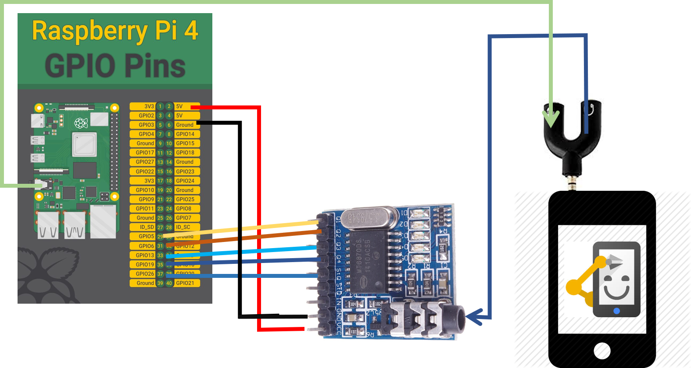

# IVRS
This project is about implementing the IVRS system using the raspberry pi and a phone and a DTMF decoder
tinydb -  for database
gtts - for generating the audio
flask - for a webserver to initiate the flow with caller ID, and respond with http response of the user confirmation 

##  SiteMap
###  src/

## Circuit Diagram

## Imp Links:
* https://components101.com/modules/mt8870-dtmf-decoder-module
* https://blog.miguelgrinberg.com/post/designing-a-restful-api-with-python-and-flask
* https://stackoverflow.com/a/7027113/1496826
* https://github.com/Drewsif/PiShrink
* https://readthedocs.org/projects/gtts/downloads/pdf/latest/
